# Fluxo Operacional — Festa com IA

> Este documento descreve o caminho da mensagem do cliente entre **WhatsApp → n8n → Postgres local → Painel da aplicação**, considerando o uso de IA para sugerir respostas, a revisão humana e a persistência do histórico.
>
> O Supabase fica restrito a **Auth** e aos dados de **profile/profissional**; não participa da persistência operacional do atendimento.

---

## Objetivo

Definir o fluxo operacional do MVP para atendimento via WhatsApp, incluindo:

- recepção de mensagens
- criação e reabertura de conversas
- criação de pedido rascunho
- geração de 3 sugestões de resposta por IA
- edição e envio manual pelo atendente
- persistência em Postgres
- tratamento de falhas e reenvio manual

---

## Princípios do fluxo

- **WhatsApp é o único canal de entrada no MVP**.
- **A IA não responde sozinha**.
- **A IA sempre gera 3 sugestões** para apoio ao atendente.
- **O atendente edita a resposta antes de enviar**.
- **O envio ao cliente é feito pelo n8n**.
- **O n8n grava direto no Postgres**.
- **Somente a mensagem final enviada é persistida como histórico final**.
- **Conversas antigas são arquivadas sem apagar**.

---

## Visão geral

```mermaid
flowchart LR
  A[Cliente envia mensagem no WhatsApp] --> B[n8n Webhook]
  B --> C[Normaliza payload e identifica telefone]
  C --> D{Existe conversa ativa?}
  D -- Sim --> E[Anexa mensagem à conversa ativa]
  D -- Não --> F[Reabre a última conversa encerrada]
  F --> G[Cria novo pedido rascunho]
  E --> G
  G --> H[Busca contexto no Postgres]
  H --> I[Agente de IA gera 3 sugestões]
  I --> J[Aplicação exibe mensagem + histórico + sugestões]
  J --> K[Atendente edita a resposta]
  K --> L[Atendente clica Enviar]
  L --> M[n8n envia a mensagem ao WhatsApp]
  M --> N[Salva mensagem final no Postgres]
  M -- falha --> O[Marca falha na própria conversa]
  O --> K
```

---

## Caminho da mensagem

### 1. Entrada da mensagem

A mensagem chega pelo **WhatsApp** e é recebida por um webhook do **n8n**.

O n8n deve:

- normalizar o payload
- identificar o telefone do cliente
- localizar a conversa relacionada

### 2. Identificação da conversa

O sistema usa a regra:

- procurar **conversa ativa** pelo telefone
- se não existir, buscar a **última conversa encerrada** daquele telefone
- se ainda assim não houver referência, criar uma conversa nova

### 3. Reabertura da conversa

Se a mensagem vier para uma conversa encerrada:

- a conversa é **reaberta automaticamente**
- um **novo pedido rascunho** é criado
- o histórico anterior é mantido

### 4. Pedido rascunho

Toda interação comercial relevante pode gerar um **pedido rascunho**.

Esse rascunho serve para:

- organizar a intenção do cliente
- guardar dados iniciais do atendimento
- alimentar o painel com contexto comercial

### 5. Contexto para IA

A IA deve usar estas fontes de contexto:

- histórico da conversa
- dados do cliente/pedido no Postgres
- prompt manual do profissional salvo na aplicação
- dados de autenticação e perfil do profissional via Supabase
- catálogo/preços vindo do Postgres local ou de regras de negócio do MVP

### 6. Resposta da IA

A IA não envia nada diretamente ao cliente.

Ela apenas gera **3 opções de resposta** para o atendente.

### 7. Painel da aplicação

O painel deve mostrar:

- mensagem original do cliente
- histórico da conversa
- 3 sugestões geradas pela IA

O atendente então:

- escolhe uma sugestão
- edita o texto
- clica em **Enviar**

### 8. Envio da resposta

Quando o atendente clica em **Enviar**:

- o n8n dispara a mensagem para o WhatsApp
- a mensagem final é salva no Postgres
- a resposta passa a fazer parte do histórico da conversa

### 9. Falha no envio

Se o envio falhar:

- a falha fica registrada **na própria conversa**
- a mensagem fica **pendente para reenvio manual**
- **qualquer atendente** pode reenviar

---

## Ciclo da conversa

### Estados

- `nova`
- `em_atendimento`
- `aguardando`
- `finalizada`

### Regras

- a conversa fica ativa enquanto houver atendimento em andamento
- a conversa é finalizada quando o pedido for:
  - **entregue**
  - **cancelado**
- conversas anteriores ficam **arquivadas sem apagar**

---

## Ciclo do pedido

### Estados sugeridos

- `rascunho`
- `agendado`
- `preparando`
- `pronto`
- `entregue`
- `cancelado`

### Regras

- a mensagem pode iniciar um **pedido rascunho**
- a confirmação do pedido é feita **manualmente pelo atendente**
- após a confirmação, o pedido entra em **Agendado**
- depois segue para:
  - `Preparando`
  - `Pronto`
  - `Entregue`
- o pedido pode ser **Cancelado** em qualquer fase
- o pagamento é tratado **mais perto do final do processo**

---

## Papel de cada camada

### n8n

Responsável por:

- receber a mensagem
- consultar e gravar dados no Postgres local
- chamar o agente de IA
- enviar a resposta final ao WhatsApp
- registrar falhas de envio

### Supabase

Responsável por:

- autenticação do usuário
- manutenção de `profiles`
- registro/cadastro do profissional da conta

### Postgres local

Responsável por:

- manter o histórico oficial da operação
- armazenar clientes, conversas, mensagens e pedidos
- preservar o estado atual do atendimento

### Aplicação

Responsável por:

- exibir a fila de atendimento
- mostrar o contexto da conversa
- exibir as 3 sugestões da IA
- permitir edição antes do envio
- exibir falhas e pendências

---

## Persistência recomendada

Para o MVP, a persistência deve seguir esta lógica:

- registrar mensagens de entrada
- registrar mensagens de saída
- registrar conversas
- registrar pedidos rascunho
- registrar falhas de envio
- arquivar conversas encerradas sem apagar

---

## Relação com o banco de dados

Este fluxo conversa diretamente com as tabelas descritas em `DATABASE_SCHEMA.md`, principalmente:

- `clients`
- `conversations`
- `messages`
- `orders`
- `payments`

Na prática, estas tabelas vivem no **Postgres local**. No Supabase permanecem apenas `profiles`, `festa-com-ia-professionals` e `regras_criacao_tabelas`.

As sugestões da IA podem permanecer apenas no fluxo operacional, sem tabela própria no MVP.

---

## Próximos passos

- detalhar o esquema de eventos entre n8n e Postgres
- definir os payloads de entrada e saída do webhook
- criar a API/serviço do painel para leitura das conversas
- implementar a persistência do pedido rascunho
- integrar o envio final de mensagens via WhatsApp
