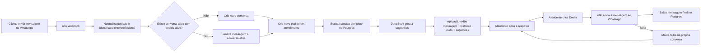

# Fluxo Operacional — Festa com IA

> Este documento descreve o caminho da mensagem do cliente entre **WhatsApp (Uazapi) → n8n → Postgres local → Painel da aplicação**, considerando o uso do DeepSeek para sugerir respostas, a revisão humana e a persistência do histórico.
>
> O Supabase fica restrito a **Auth** e aos dados de **`festa-com-ia-professionals`**; não participa da persistência operacional do atendimento.
>
> A UI operacional também escuta o Postgres local em tempo real por `LISTEN/NOTIFY` + SSE, então mudanças vindas do n8n ou da própria aplicação aparecem sem polling.
>
> Status atual do n8n: o workflow **inbound** está ativo; o workflow **outbound** existe, mas está desativado no momento.
>
> Quando um pedido é marcado como `entregue` ou `cancelado` na aplicação, a conversa vinculada é finalizada e arquivada; novas mensagens do mesmo cliente devem abrir uma nova conversa/pedido.

---

## Objetivo

Definir o fluxo operacional do MVP para atendimento via WhatsApp, incluindo:

- recepção de mensagens
- identificação de conversa ativa por cliente
- criação de novo pedido quando surgir um novo atendimento, reutilizando apenas conversas/pedidos ainda ativos
- geração de 3 sugestões de resposta via DeepSeek
- edição e envio manual pelo atendente
- persistência em Postgres
- tratamento de falhas e reenvio manual

---

## Princípios do fluxo

- **WhatsApp via Uazapi é o único canal de entrada no MVP**.
- **A documentação oficial de chamadas, webhooks, envio de mensagens e etiquetas da Uazapi fica em `docs.uazapi.com`**.
- **O DeepSeek não responde sozinho**.
- **O DeepSeek sempre gera 3 sugestões** para apoio ao atendente.
- **O atendente edita a resposta antes de enviar**.
- **O envio ao cliente é feito pelo n8n**.
- **O n8n grava direto no Postgres**.
- **Pedidos entregues/cancelados finalizam a conversa vinculada**.
- **O inbound do n8n não deve reutilizar conversa/pedido arquivado**.
- **Somente a mensagem final enviada é persistida como histórico final**.
- **Conversas antigas são arquivadas sem apagar**.

---

## Visão geral

---

## Caminho da mensagem

### 1. Entrada da mensagem

A mensagem chega pelo **WhatsApp** e é recebida por um webhook do **n8n**.

O n8n deve:

- normalizar o payload
- identificar o telefone do cliente
- localizar a conversa relacionada

### 2. Identificação da conversa

O sistema usa a regra:

- procurar **conversa ativa** do cliente pelo telefone
- considerar ativa apenas a conversa que ainda estiver com pedido em andamento
- se existir, anexar a nova mensagem a essa conversa
- se não existir, criar uma **nova conversa** e um **novo pedido** em atendimento
- se houver uma conversa anterior do mesmo cliente, usar esse histórico como base de contexto para a IA quando fizer sentido operacionalmente

### 3. Novo pedido na mesma conversa

Toda conversa possui **um pedido associado**.

Se surgir um segundo pedido dentro da mesma conversa:

- o profissional deve criar **manual e explicitamente** um novo pedido
- o pedido anterior deve permanecer preservado
- a conversa continua como trilha de comunicação do mesmo cliente

### 4. Contexto para o DeepSeek

A IA deve usar estas fontes de contexto:

- histórico completo da conversa ativa
- histórico da última conversa ativa, se a conversa atual for nova
- exemplos de conversas do profissional
- regras de atendimento do profissional
- dados dos produtos do profissional
- dados do cliente/pedido no Postgres
- histórico completo de pedidos do cliente como contexto auxiliar
- dados de autenticação e perfil do profissional via Supabase (`festa-com-ia-professionals`)

O contexto deve ser enviado como prompt de sistema ou estrutura equivalente no fluxo do n8n.

### 5. Resposta do DeepSeek

O DeepSeek não envia nada diretamente ao cliente.

Ela apenas gera **3 opções de resposta** para o atendente.

### 6. Painel da aplicação

O painel deve mostrar:

- mensagem original do cliente
- um pequeno histórico da conversa
- 3 sugestões geradas pela IA
- contexto comercial do pedido, incluindo grupo, subgrupo e variação quando existirem

O atendente então:

- escolhe uma sugestão
- edita o texto
- clica em **Enviar**

Quando o banco muda, o painel e a tela de pedidos recebem um evento realtime e revalida-se o servidor, mantendo os dados sincronizados com o Postgres local sem depender de cache do navegador.

### 7. Envio da resposta

Quando o atendente clica em **Enviar**:

- o n8n dispara a mensagem para o WhatsApp
- a mensagem final é salva no Postgres
- a resposta passa a fazer parte do histórico da conversa

### 8. Falha no envio

Se o envio falhar:

- a falha fica registrada **na própria conversa**
- a mensagem fica **pendente para reenvio manual**
- **qualquer atendente** pode reenviar

---

## Ciclo da conversa

### Estados

- `nova`
- `em_atendimento`
- `aguardando`
- `finalizada`

### Regras

- a conversa fica ativa enquanto houver atendimento em andamento
- cada conversa fica associada a um pedido principal
- se houver um novo pedido no mesmo atendimento, o profissional cria outro pedido manualmente
- a conversa é finalizada quando o pedido for:
  - **entregue**
  - **cancelado**
- conversas anteriores ficam **arquivadas sem apagar**

---

## Ciclo do pedido

### Estados sugeridos

- `rascunho`
- `agendado`
- `preparando`
- `pronto`
- `entregue`
- `cancelado`

### Regras

- a primeira mensagem pode iniciar um **pedido em atendimento**
- se o pedido precisar ser separado em outro atendimento, o profissional cria um novo pedido manualmente
- após a confirmação, o pedido pode evoluir para estados posteriores conforme a operação
- o pedido pode ser **Cancelado** em qualquer fase
- o pagamento é tratado **mais perto do final do processo**

---

## Papel de cada camada

### n8n

Responsável por:

- receber a mensagem
- consultar e gravar dados no Postgres local
- chamar o modelo DeepSeek
- enviar a resposta final ao WhatsApp
- registrar falhas de envio

### Supabase

Responsável por:

- autenticação do usuário
- manutenção de `festa-com-ia-professionals`
- registro/cadastro do profissional da conta

### Postgres local

Responsável por:

- manter o histórico oficial da operação
- armazenar clientes, conversas, mensagens e pedidos
- preservar o estado atual do atendimento

### Aplicação

Responsável por:

- exibir a fila de atendimento
- mostrar o contexto da conversa
- exibir as 3 sugestões da IA
- permitir edição antes do envio
- exibir falhas e pendências

---

## Persistência recomendada

Para o MVP, a persistência deve seguir esta lógica:

- registrar mensagens de entrada
- registrar mensagens de saída
- registrar conversas
- registrar pedidos vinculados à conversa
- registrar falhas de envio
- arquivar conversas encerradas sem apagar

---

## Relação com o banco de dados

Este fluxo conversa diretamente com as tabelas descritas em `DATABASE_SCHEMA.md`, principalmente:

- `clients`
- `conversations`
- `messages`
- `orders`
- `payments`

Na prática, estas tabelas vivem no **Postgres local**. No Supabase permanecem apenas `festa-com-ia-professionals` e `regras_criacao_tabelas`.

Na implementação atual, o cadastro do profissional e a taxonomia personalizada vivem em `festa-com-ia-professionals`, enquanto a referência global de grupos/subgrupos/variações fica em `product_taxonomy_reference` no Postgres local.

As sugestões da IA são persistidas diretamente na tabela `messages` (coluna `suggestions`), permitindo que o Painel as recupere via histórico.

---

## Próximos passos

- detalhar o esquema de eventos entre n8n e Postgres
- definir os payloads de entrada e saída do webhook
- implementar a persistência do pedido rascunho
- integrar o envio final de mensagens via WhatsApp
